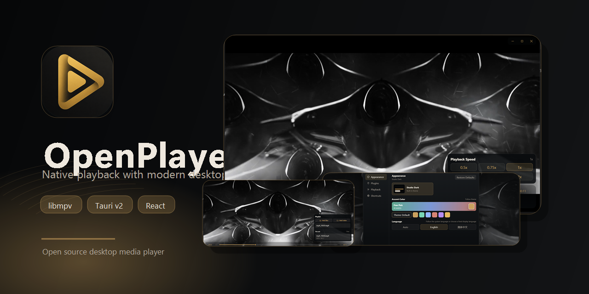
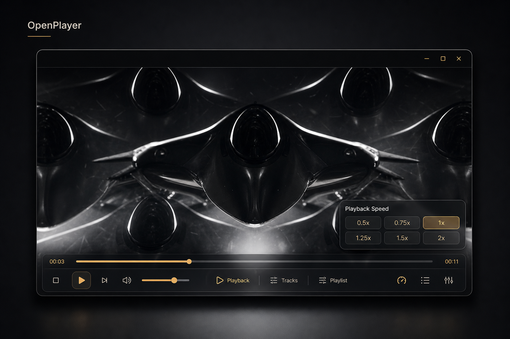
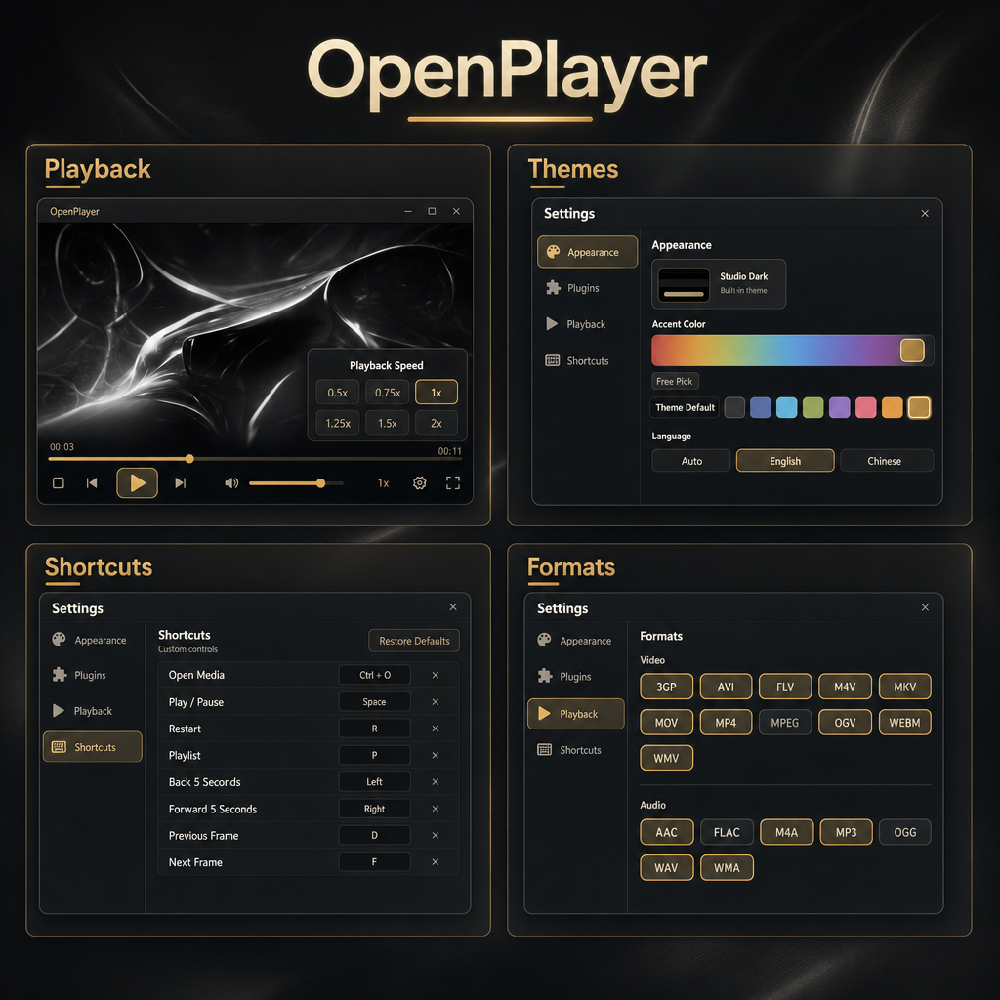

<div align="center">



# 🎬 OpenPlayer

**基于 Tauri v2、Rust、React 与 libmpv 构建的美观、可扩展、高性能桌面媒体播放器**

<p>
  <a href="README.md"></a>
  <a href="README.zh-CN.md"></a>
</p>

[](https://github.com/AreChen/OpenPlayer/releases)
[](https://github.com/AreChen/OpenPlayer/releases/latest)
[](https://github.com/AreChen/OpenPlayer/releases/latest)
[](https://github.com/AreChen/OpenPlayer/releases/latest)
[](https://tauri.app/)
[](https://www.rust-lang.org/)
[](LICENSE)

[下载安装包](https://github.com/AreChen/OpenPlayer/releases/latest) · [发布说明](docs/releases/v1.5.0.md) · [插件 SDK](docs/plugins/sdk-1.5-developer-guide.md) · [许可证](LICENSE)

</div>

---

## ✨ 项目介绍

OpenPlayer 是一个使用 **Tauri v2 + Rust + React + libmpv** 构建的轻量、美观桌面媒体播放器。它让播放画面尽量贴近原生 mpv 渲染路径，同时使用透明 React 覆盖层承载控件、菜单、快捷键和设置界面。

当前默认播放路径是 `mpv-embed`：主 Tauri 窗口作为原生 libmpv 视频宿主，透明 overlay 窗口承载交互 UI。这样的架构兼顾原生播放性能、窗口稳定性和现代桌面界面的可定制能力。



## 🚀 功能亮点

- ⚡ **原生 mpv 播放内核**：基于 libmpv 的嵌入式播放后端，继承 mpv 的格式兼容性和解码能力。
- 🪟 **视频宿主 + 透明控件层**：视频渲染与 React 控件分离，兼顾稳定性、响应速度和 UI 表现。
- 🌐 **中英文界面**：支持英文和简体中文，并可根据系统语言自动适配。
- 🎨 **Studio Dark 主题**：内置深色视觉系统，支持主题强调色自定义，并在多窗口间同步。
- ⌨️ **可靠快捷键系统**：支持可配置快捷键，并通过 Windows 原生快捷键桥接解决视频区域聚焦后的按键失效问题。
- 🎞️ **精细播放控制**：支持全屏恢复、平滑进度、逐帧播放、循环模式、倍速、轨道选择和字幕控制。
- 🧭 **智能界面隐藏**：播放时无操作自动隐藏控件与标题栏，鼠标离开窗口后也会隐藏。
- 🗂️ **播放记忆**：最近播放和进度记忆使用轻量 redb 存储，并支持清除记录和无痕播放。
- 🧩 **开放插件 SDK**：用户安装的插件可以声明权限、持久化运行时数据、打开自定义视图、监听播放事件，并在受控权限下调用 mpv API。
- 🧩 **桌面集成**：支持可选的 Windows 媒体关联和资源管理器预览格式注册。



## 🧩 插件与 SDK

OpenPlayer 1.5.0 将插件体系扩展为面向外部开发者和 AI 辅助开发的文档化 SDK。插件可以使用类型化 manifest、宿主能力检查、运行时事件、隔离存储、受校验的网络请求、自定义视图、原生对话框，以及受权限控制的 mpv 播放、滤镜、OSD 和脚本消息能力。

- SDK 指南：[docs/plugins/sdk-1.5-developer-guide.md](docs/plugins/sdk-1.5-developer-guide.md)
- 插件宿主概览：[docs/plugins/README.md](docs/plugins/README.md)
- 官方插件包：[AreChen/openplayer-plugins](https://github.com/AreChen/openplayer-plugins)

## 📦 下载

最新版本可在 GitHub Releases 下载：

[](https://github.com/AreChen/OpenPlayer/releases/latest)

当前版本：

- 🏷️ `v1.5.0`
- 🪟 Windows：`OpenPlayer_1.5.0_x64-setup.exe`
- 🐧 Linux：`OpenPlayer_1.5.0_amd64.deb` 和 `OpenPlayer_1.5.0_amd64.AppImage`
- 🍎 macOS：`OpenPlayer_1.5.0_arm64.dmg` 和 `OpenPlayer_1.5.0_x64.dmg`
- 🔐 校验文件：Release Assets 中提供 `.sha256`

> Windows 安装包暂未配置商业代码签名，首次安装时可能出现 SmartScreen 提示。
> Linux 包是当前阶段的初始发行目标，仍依赖宿主桌面媒体环境，包括系统 libmpv。

## ⌨️ 默认快捷键

| 操作 | 快捷键 |
| --- | --- |
| 打开媒体 | `Ctrl + O` |
| 播放 / 暂停 | `Space` |
| 后退 5 秒 | `Left` |
| 前进 5 秒 | `Right` |
| 上一帧 | `D` |
| 下一帧 | `F` |
| 全屏 / 恢复 | `Enter` |
| 音量 | 鼠标滚轮 / `Up` / `Down` |

## 🛠️ 本地开发

环境要求：

- Rust stable toolchain
- Node.js 20+
- npm 10+
- Tauri v2 对应平台系统依赖
- Windows 构建需要本仓库中的 `vendor/native/mpv/windows-x64`

安装依赖：

```powershell
Set-Location apps/desktop
npm install
```

运行开发版：

```powershell
Set-Location apps/desktop
npm run tauri:dev
```

验证项目：

```powershell
npm run verify:shell
npm run build
cargo test -p openplayer-desktop
```

构建 Windows 安装包：

```powershell
Set-Location apps/desktop
npm run tauri:build -- --config src-tauri/tauri.windows.conf.json
```

构建产物位于：

```text
target/release/bundle/nsis/
```

## 🤝 项目关联

OpenPlayer 建立在这些优秀开源项目之上：

- [Tauri](https://tauri.app/)：安全、轻量的桌面应用外壳。
- [Rust](https://www.rust-lang.org/)：原生后端、系统集成和持久化能力。
- [mpv / libmpv](https://mpv.io/)：高质量媒体播放内核。
- [React](https://react.dev/)：覆盖层控件和设置界面。
- [Vite](https://vite.dev/) 与 [TypeScript](https://www.typescriptlang.org/)：前端构建和类型系统。
- [redb](https://github.com/cberner/redb)：用于历史记录、设置和播放状态的嵌入式持久化存储。

## ⚖️ 许可证说明

OpenPlayer 应用源码使用 MIT License。发行包还会包含或链接一些使用各自许可证的上游组件。

- Tauri、Rust 生态依赖、React、Vite、TypeScript 和 redb 根据包元数据主要使用 MIT、Apache-2.0 或类似宽松许可证。
- Windows 发行自动化使用 `zhongfly/mpv-winbuild` 提供的 `mpv-dev-lgpl` libmpv 构建，以便让打包的媒体运行时更适合 OpenPlayer 当前的 MIT 应用源码许可。
- Linux 包依赖发行版提供的 `libmpv2`；macOS 包会打包 Homebrew libmpv dylib。对应平台上游包的 notice、源码和再分发义务仍按各自许可证执行。

## 📄 许可证

OpenPlayer 使用 [MIT License](LICENSE) 开源。
